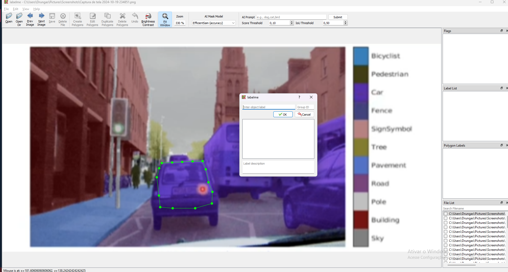

# Anotação de imagens
A anotação é uma técnica manual em imagens, que o usuário define os limites da caixa delimetadora real ou do formato real do objeto que será segmentado. Utiliza-se essa técnica para saber quais são as resposta verdadeiras que o modelo precisa entregar.

## Ferramentas
### Labelme
Labelme é uma ferramenta de anotação gráfica de imagens. Muito usada para segmentação:
Para instalar use:
```py
pip3 install git+https://github.com/labelmeai/labelme
```

e para usar faça
```py
labelme   # specify label list with a file
```

Com isso deve acessar essa tela:


Agora clique em Open dir e acesse o diretorio das suas imagens, após isso ele deverá acessar a 1° imagem e com isso você já pode anotar.


Após isso clique e Create Polygons e comece a criar as mascaras de segmentação, ao terminar a mascara, um popup de label irá surgir onde voce pode criar um ou colocar um ja existente, para criar é so digitar o nome e clicar em ok.




Ao terminar clique em Save e ele criará o JSON com o poligono desenhado, após isso você precisará clonar o repostório do labelme e usará na pasta examples/instace_segmentation o comando
`python labelme2voc.py my_data_annotated --labels labels.txt output_dir`, onde o my_data_annotated é a pasta das suas imagens com as anotações, labels é o arquivo de texto que contém todas as classes e output_dir é a pasta que surgirá o resultado.

# Hiperametros de Treinamento
## Parâmetros de model.compile() (Tensorflow)
1. **optimizer**
   - **Descrição:** Define o otimizador que ajusta os pesos durante o treinamento.
   - **Exemplos:**
     - `'adam'`: Adam (Adaptive Moment Estimation).
     - `'sgd'`: Gradiente Estocástico.
     - `'rmsprop'`: RMSProp Optimizer.
   - **Ou:** Pode ser um objeto customizado, como `tf.keras.optimizers.Adam(learning_rate=0.001)`.

2. **loss**
   - **Descrição:** Define a função de perda que o modelo tentará minimizar.
   - **Exemplos:**
     - `'sparse_categorical_crossentropy'`: Para classificação multi-classe com rótulos inteiros.
     - `'categorical_crossentropy'`: Para multi-classe com rótulos *one-hot*.
     - `'binary_crossentropy'`: Para classificação binária.
   - **Ou:** Pode ser um objeto customizado, como `tf.keras.losses.MeanSquaredError()`.

3. **metrics**
   - **Descrição:** Define métricas para avaliar a performance do modelo durante o treinamento e teste.
   - **Exemplos:**
     - `'accuracy'`: Acurácia simples.
     - `'precision'`: Precisão para classificação.
     - `'recall'`: Taxa de recuperação para classificação.
     - `'mae'`: Erro absoluto médio.
   - **Ou:** Pode ser uma lista de objetos personalizados.

4. **loss_weights**
   - **Descrição:** Atribui pesos diferentes para cada função de perda (usado em modelos com várias saídas).
   - **Exemplo:** `{'output1': 1.0, 'output2': 0.5}`.

5. **weighted_metrics**
   - **Descrição:** Define métricas que recebem pesos amostrais durante o cálculo.
   - **Exemplo:** `['accuracy']` com pesos diferenciados por amostra.

6. **run_eagerly**
   - **Descrição:** Controla se o modelo será executado em modo ansioso, útil para depuração e compreensão de erros.
   - **Exemplo:** `True` ou `False`.

7. **steps_per_execution**
   - **Descrição:** Define o número de *batches* a serem executados antes de uma atualização do modelo, para melhorar a performance.
   - **Exemplo:** `steps_per_execution=1`.

8. **jit_compile**
   - **Descrição:** Se `True`, ativa o XLA (Accelerated Linear Algebra) para compilar o modelo de maneira otimizada.
   - **Exemplo:** `jit_compile=True`.
   
## Parâmetros de model.fit() (Tensorflow)
1. **x**  
   - **Descrição:** Conjunto de entrada (dados de treinamento). Pode ser um array NumPy, uma lista de arrays ou um objeto do tipo `tf.data.Dataset`.
   - **Exemplo:** `x_train` contendo imagens para treino.

2. **y**  
   - **Descrição:** Saídas correspondentes (rótulos) para as amostras de treino. Pode ser um array NumPy ou uma lista.
   - **Exemplo:** `y_train` contendo classes dos dados.

3. **batch_size**  
   - **Descrição:** Número de amostras a serem usadas em cada iteração.
   - **Exemplo:** `batch_size=32`.

4. **epochs**  
   - **Descrição:** Número total de vezes que o modelo verá todo o conjunto de dados de treinamento.
   - **Exemplo:** `epochs=10`.

5. **verbose**  
   - **Descrição:** Controle do nível de detalhes que são exibidos durante o treinamento.
     - `0`: Não exibe nada.
     - `1`: Exibe uma barra de progresso.
     - `2`: Exibe uma linha por época.
   - **Exemplo:** `verbose=1`.

6. **callbacks**  
   - **Descrição:** Lista de funções a serem chamadas durante o treinamento em momentos específicos (início/fim da época, etc.).
   - **Exemplo:** `[tf.keras.callbacks.EarlyStopping(monitor='val_loss')]`.

7. **validation_data**  
   - **Descrição:** Dados usados para avaliar o modelo ao final de cada época. Pode ser um tuplo `(x_val, y_val)`.
   - **Exemplo:** `validation_data=(x_val, y_val)`.

8. **validation_split**  
   - **Descrição:** Fração dos dados de treinamento que será usada para validação.
   - **Exemplo:** `validation_split=0.2`.

9. **shuffle**  
   - **Descrição:** Indica se as amostras de treino serão embaralhadas a cada época.
   - **Exemplo:** `shuffle=True`.

10. **class_weight**  
    - **Descrição:** Dicionário que associa classes a pesos, usado para lidar com classes desbalanceadas.
    - **Exemplo:** `{0: 1.0, 1: 0.5}`.

11. **sample_weight**  
    - **Descrição:** Array que fornece um peso para cada amostra durante o treinamento.
    - **Exemplo:** `[1.0, 0.5, 1.0, ...]`.

12. **steps_per_epoch**  
    - **Descrição:** Número de batches a serem executados em cada época.
    - **Exemplo:** `steps_per_epoch=100`.

13. **validation_steps**  
    - **Descrição:** Número de batches a serem executados na validação por época.
    - **Exemplo:** `validation_steps=50`.

14. **initial_epoch**  
    - **Descrição:** Época inicial a partir da qual o treinamento será retomado (usado em treinos interrompidos).
    - **Exemplo:** `initial_epoch=5`.

15. **max_queue_size**  
    - **Descrição:** Tamanho máximo da fila de dados para treinamento assíncrono.
    - **Exemplo:** `max_queue_size=10`.

16. **workers**  
    - **Descrição:** Número de processos paralelos usados para carregar dados.
    - **Exemplo:** `workers=4`.

17. **use_multiprocessing**  
    - **Descrição:** Se `True`, permite o uso de multiprocessamento para carregamento de dados.
    - **Exemplo:** `use_multiprocessing=True`.

