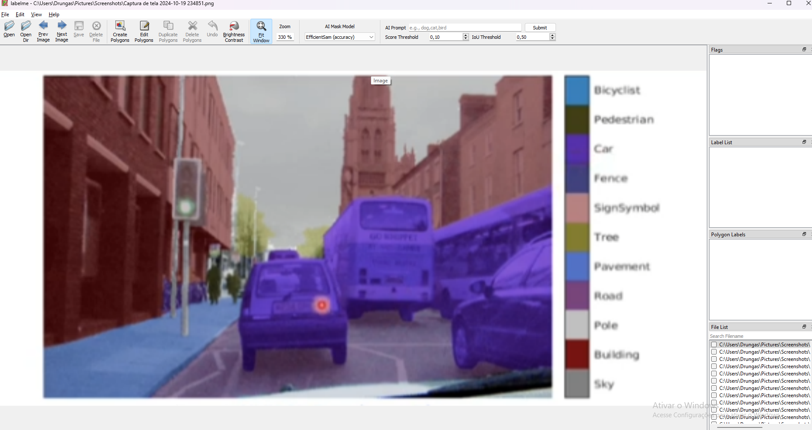

# Anotação de imagens
A anotação é uma técnica manual em imagens, que o usuário define os limites da caixa delimetadora real ou do formato real do objeto que será segmentado. Utiliza-se essa técnica para saber quais são as resposta verdadeiras que o modelo precisa entregar.

## Ferramentas
### Labelme
Labelme é uma ferramenta de anotação gráfica de imagens. Muito usada para segmentação:
Para instalar use:
```py
pip3 install git+https://github.com/labelmeai/labelme
```

e para usar faça
```py
labelme   # specify label list with a file
```

Com isso deve acessar essa tela:


Agora clique em Open dir e acesse o diretorio das suas imagens, após isso ele deverá acessar a 1° imagem e com isso você já pode anotar.




Após isso clique e Create Polygons e comece a criar as mascaras de segmentação, ao terminar a mascara, um popup de label irá surgir onde voce pode criar um ou colocar um ja existente, para criar é so digitar o nome e clicar em ok.


Ao terminar clique em Save e ele criará o JSON com o poligono desenhado, após isso você precisará clonar o repostório do labelme e usará na pasta examples/instace_segmentation o comando
`python labelme2voc.py my_data_annotated --labels labels.txt output_dir`, onde o my_data_annotated é a pasta das suas imagens com as anotações, labels é o arquivo de texto que contém todas as classes e output_dir é a pasta que surgirá o resultado.

