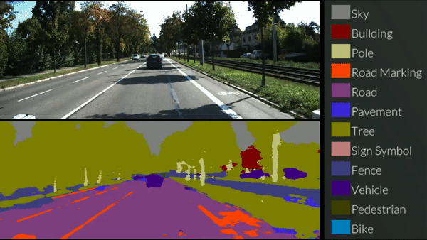

# Desafios em Segmentação de Objetos

## Generalização para Diversos Contextos
Segmentar objetos em ambientes complexos, com variações de iluminação, ângulos e resoluções, é um grande desafio. Os modelos precisam ser robustos o suficiente para manter precisão e desempenho em diferentes cenários. 

## Segmentação Multi-escala:
Em imagens com objetos de tamanhos muito variados, os modelos devem ser capazes de detectar e segmentar objetos em múltiplas escalas.

## Ocultação e Sobreposição de Objetos
Em imagens onde objetos estão parcialmente ocultos ou se sobrepõem, é difícil identificar e delinear com precisão os limites entre eles. Essas situações exigem modelos capazes de compreender a estrutura dos objetos e, assim, segmentá-los de forma precisa, mesmo quando apenas partes são visíveis.

## Acurácia vs. Velocidade de Processamento
Em muitas aplicações práticas, especialmente em tempo real, há um conflito entre acurácia e velocidade. Conseguir uma segmentação precisa e rápida ao mesmo tempo requer um balanço complexo no design do modelo e otimizações que atendam à demanda da aplicação.

## Segmentação em Vídeo e Consistência Temporal
Na segmentação de vídeo, além da precisão espacial, a consistência temporal é necessária. O modelo precisa manter a continuidade dos objetos de quadro a quadro, mesmo com variações de movimento, iluminação e ângulo.

## Anotação de Dados e Custo
O treinamento de modelos de segmentação requer uma quantidade substancial de dados anotados com precisão, o que é caro e consome tempo. 

# Tendências Atuais em Segmentação de Objetos

## Redes baseadas em Transformers
Redes baseadas em Transformers estão revolucionando a visão computacional ao aplicarem mecanismos de atenção, antes populares em processamento de linguagem natural, para tarefas como classificação, segmentação e detecção de objetos em imagens.

### Componentes Principais:
1.Divisão em Patches: A imagem é dividida em pequenos blocos chamados "patches" (como uma grade). Cada patch é tratado como um token, semelhante a uma palavra em um Transformer para texto.

2.Codificação e Embedding dos Patches: Cada patch recebe uma codificação (embedding), que inclui informações sobre sua posição na imagem. Isso permite que o Transformer "saiba" onde cada patch está, mesmo sem uma estrutura de grade fixa, como nas redes convolucionais.

3.Mecanismo de Atenção: Cada patch "observa" todos os outros patches através da atenção, ou seja, ele calcula a importância de cada outro patch em relação a ele. Em termos práticos, isso é feito ao multiplicar os vetores que representam os patches e aplicar pesos de importância. Assim, o modelo aprende a dar mais atenção a patches relevantes (por exemplo, uma área que contém uma borda importante ou um objeto).

4.Interações Globais: A atenção permite interações globais entre todas as partes da imagem, algo que é difícil de alcançar com convoluções. Isso permite que o modelo capture relações de longo alcance, entendendo, por exemplo, a conexão entre a cabeça e o corpo de uma pessoa em uma imagem, mesmo que eles estejam em diferentes regiões.

## Segmentação Orientada por Dados Sintéticos
Uma abordagem em visão computacional que utiliza imagens ou dados sintéticos gerados artificialmente para treinar e melhorar modelos de segmentação de objetos.

## Modelos de Segmentação em Tempo Real
1.Redução de Latência e Eficiência Computacional: O desenvolvimento de modelos de segmentação mais leves e eficientes permite a segmentação em tempo real em dispositivos de baixa capacidade, como câmeras móveis e drones.
2.Segmentação Baseada em Edge Computing: Com o aumento de dispositivos conectados e IoT, a segmentação em tempo real próximo ao local de captura dos dados (na “edge”) reduz a latência e permite a análise de dados ao vivo.