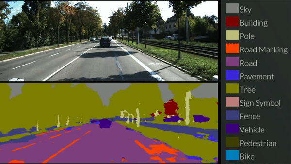
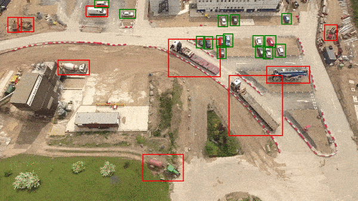
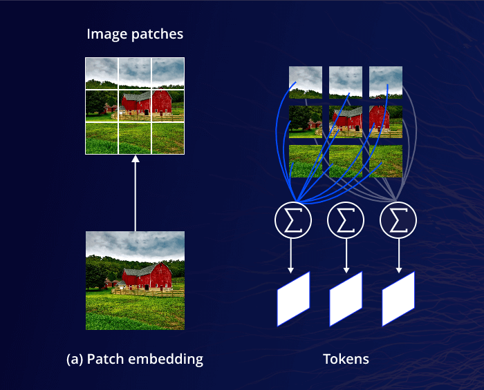

# Desafios em Segmentação de Objetos

## Generalização para Diversos Contextos
Segmentar objetos em variados contextos e ambientes é um grande desafio. Os modelos precisam ser robustos o suficiente para manter precisão e desempenho em diferentes cenários. 
**variações de iluminação**
**Diferentes ângulos**
**Resoluções Variadas**
**Diversidade na forma do objeto**

## Segmentação Multi-escala:
Em imagens com objetos de tamanhos muito variados, os modelos devem ser capazes de detectar e segmentar objetos em múltiplas escalas. 
**Overfitting:** O ajuste do modelo para escalas muito diferentes pode torna-lo muito generalista.
**Custo Computacional:** Processar imagens em várias escalas aumenta o custo computacional, tornando a inferência mais lenta, especialmente em dispositivos com recursos limitados.
**Ambiguidade:** Objetos de diferentes escalas podem ser confundidos em imagens complexas.

## Ocultação e Sobreposição de Objetos
Em imagens onde objetos estão parcialmente ocultos ou se sobrepõem, é difícil identificar e delinear com precisão os limites entre eles. Essas situações exigem modelos capazes de compreender a estrutura dos objetos e, assim, segmentá-los de forma precisa, mesmo quando apenas partes são visíveis.

## Acurácia vs. Velocidade de Processamento
Em muitas aplicações práticas, especialmente em tempo real, há um conflito entre acurácia e velocidade. Conseguir uma segmentação precisa e rápida ao mesmo tempo requer um balanço complexo no design do modelo e otimizações que atendam à demanda da aplicação.

## Segmentação em Vídeo e Consistência Temporal
Na segmentação de vídeo, além da precisão espacial, a consistência temporal é necessária. O modelo precisa manter a continuidade dos objetos de quadro a quadro, mesmo com variações de movimento, iluminação e ângulo.

## Anotação de Dados e Custo
O treinamento de modelos de segmentação requer uma quantidade substancial de dados anotados com precisão, o que é caro e consome tempo. 

# Tendências Atuais em Segmentação de Objetos

## Modelos de Segmentação em Tempo Real
**Redução de Latência e Eficiência Computacional:** O desenvolvimento de modelos de segmentação mais leves e eficientes permite a segmentação em tempo real em dispositivos de baixa capacidade, como câmeras móveis e drones.
**Segmentação Baseada em Edge Computing:** Abordagem que envolve a realização de processamento e análise de dados diretamente em dispositivos periféricos (edge devices), como câmeras, drones ou sensores.

## Segmentação Orientada por Dados Sintéticos
Uma abordagem em visão computacional que utiliza imagens ou dados sintéticos gerados artificialmente para treinar e melhorar modelos de segmentação de objetos.

## Redes baseadas em Transformers
Originalmente desenvolvidos para processamento de linguagem natural, foram adaptados para tarefas de visão computacional devido à sua capacidade de capturar relações globais em dados de entrada.

### Componentes Principais:
**Divisão em Patches:** A imagem é dividida em pequenos blocos chamados "patches" (como uma grade). Cada patch é tratado como um token, semelhante a uma palavra em um Transformer para texto.

**Codificação e Embedding dos Patches:** Cada patch recebe uma codificação (embedding), que inclui informações sobre sua posição na imagem.

**Mecanismo de Atenção** É aplicado um "peso" de importância para cada patch, assim o modelo é capaz de aprende a dar mais atenção a patches relevantes (por exemplo, uma área que contém uma borda importante ou um objeto).