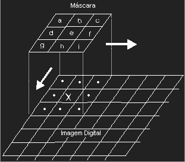
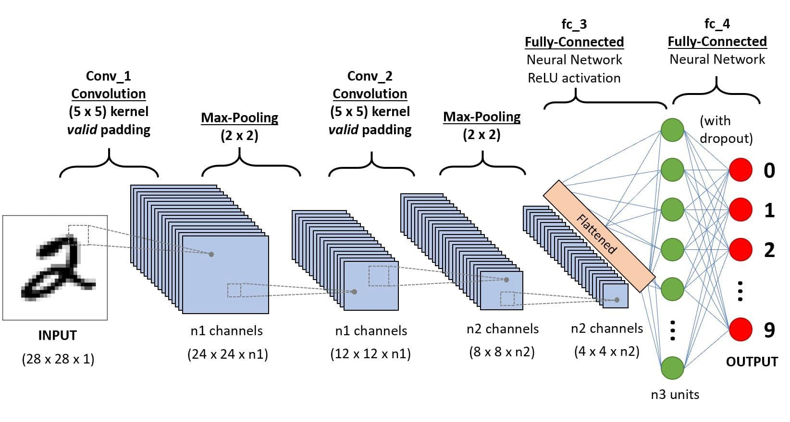
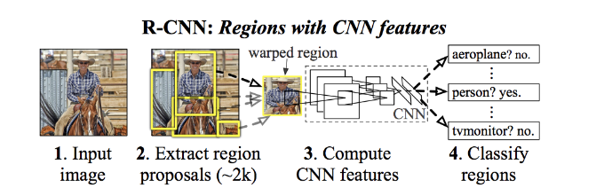
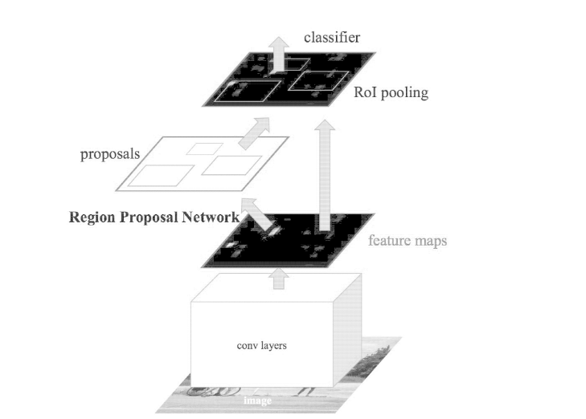
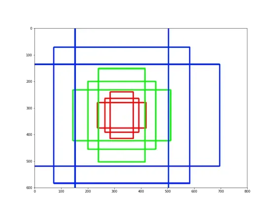
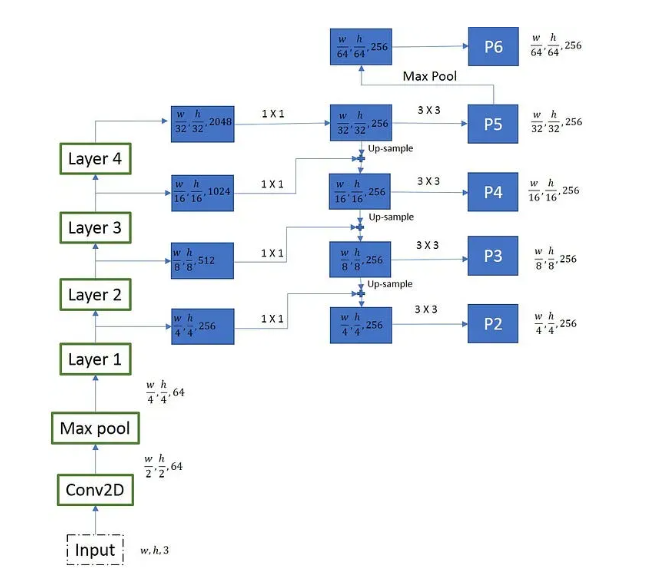
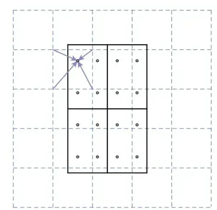
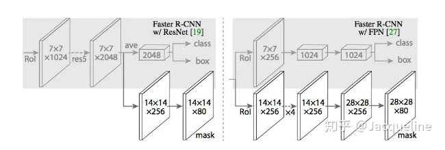
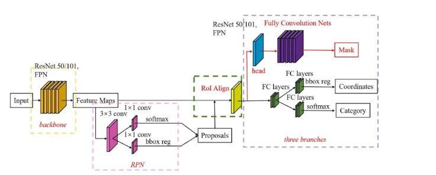
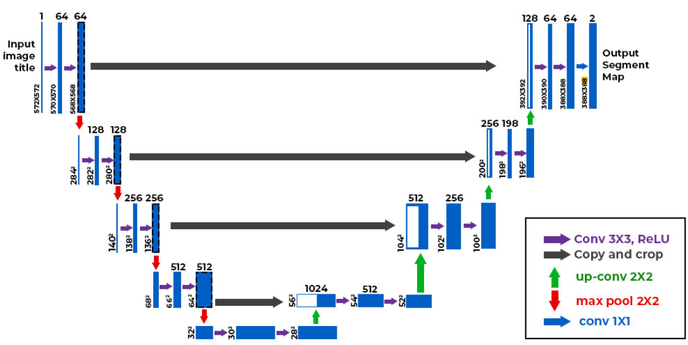

# Arquiteturas de Deep Learning para segmentação
## CNN (Redes Neurais Convolucionais)
É uma arquitetura de deep learning que utilizada de camadas convolucionais para aplicar filtros em imagens e  assim extrair caracteristícas dessas. Ela é composta de múltiplas camadas, incluindo camadas convolucionais, camadas de pooling e camadas totalmente conectadas. Assim, as camadas são divididas em:
1. Camadas Convulocionais: São camdas que realizam convoluções na imagem de entrada, aplicando filtros/kernels que irão extrair caracteristicas da entrada, como borda, textura, cor e padrões mais complexos. Operações convolucionais ajudam a preservar as relações espaciais entre pixels.

2. Camadas de Pooling: Camadas de pooling acabam reduzindo a amostragem das dimensões espaciais da imagem de entrada, reduzindo assim a complexidade computacional que o treino oferece junto com os parametros da rede

3. Funções de ativação: São funções matemáticas que introduzem a não-linearidade do modelo, fazendo com que o modelo aprenda padrões mais complexos dos dados.

4. Camadas totalmente conectadas: São as camadas que fazem as previsões necessárias com base no aprendizado das outras camadas, ou seja, é onde o modelo ira classifica/detectar/segmentar um objeto na imagem.

## R-CNN (Region-based Convolutional Neural Network)
As R-CNN utilizam da CNN para exercer as suas funções de classificar objetos mas com uma lógica a mais: Elas dividem a imagem em diversas regiões potenciais como entrada para uma CNN comum.
"O R-CNN começa dividindo a imagem de entrada em várias regiões ou sub-regiões. Essas regiões são chamadas de "propostas de região" ou "candidatos de região". A etapa de proposta de região é responsável por gerar um conjunto de regiões potenciais na imagem que provavelmente contêm objetos." (roboflow)

Essa divisão na verdade é feita por uma técnica externa ao modelo, que pode ser a Busca seletiva ou algum tipo de detecção de bordas. Entretanto a maioria das R-CNNs utilizam da Busca Seletiva, essa funciona mesclando ou dividindo a imagem em diversos segmentos com base em alguma indicações: cor, textura, forma. Para criar um conjunto diversisificado de regiões e assim acaba enviando essas regiões na entrada da rede para exercer a classificação.

## Fast R-CNN
Em vez de enviar regiões na entrada, são enviados a imagem e as regiões, entretandto cada região passa por uma camada de pooling para formar um conjunto de caracteristicas do mesmo tamanho, isso garante que as regiões contenham o mesmo tamanho e no final dessa camada de pooling é pegado esses mapas de caracteristicas e agrupados em um unico vetor de caracteristicas e com isso a rede contém a 2 saídas: a probabilidade de ser o objeto e a caixa delimetadora.

A camada de RoI pooling utiliza max pooling para converter as características dentro de qualquer região de interesse válida em um pequeno mapa de características com uma extensão espacial fixa de H×W, por exemplo 7x7, onde 𝐻 e 𝑊 são hiperparâmetros da camada independentes de qualquer RoI específico.

O RoI max pooling funciona dividindo a janela RoI de ℎ×𝑤 em uma grade de sub-janelas de 𝐻 × 𝑊 com tamanho aproximado de ℎ/𝐻 × 𝑤/𝑊. Em seguida, é aplicado o max pooling aos valores de cada sub-janela, armazenando o valor máximo na célula correspondente da grade de saída. O pooling é realizado de forma independente para cada canal do mapa de características, como no max pooling padrão.

O Faster R-CNN compartilha computações (ou seja, cálculos de camada convolucional) em todas as propostas (ou seja, ROIs) em vez de fazer os cálculos para cada proposta independentemente. 

## Faster R-CNN
Esse modelo contém a atualização de retirar a dependencia da busca seletiva e adiciona uma rede em paralelo chamada de Region Proposal Network, que agora pega o mapa de caracteristicas extraidos e vai definindo regiões de interesse da imagem com base em ancoras(diversos bounding boxes espalhados que ao juntar a interseção deles é apresentado a caixa que mais define o objetp).

## Mask R-CNN
Utilizando a arquitetura da Faster R-CNN com algumas melhorias, tal como a Mask Head e as FPNS. Mas para isso é necessário detalhar a arquitetura dessa rede
### Redes Backbone
Basicamente a Backbone é uma rede neural convulocional pré treinada, onde ela processa a imagem de entrada e extrai caracteristicas de alto nível. Assim, a FPN (Feature Pyramid Network) é utilizada para criar uma pirâmide de caracteristicas baseadas em diversas dimensões especificas. Essa pirâmide inclui caracteristicas com resoluções espaciais variadas, de recursos de alta resolução com informações semânticas ricas a recursos de baixa resolução com detalhes espaciais mais precisos.

A FPN funciona nas seguintes etapas:

1. Extração de recursos : a rede de backbone extrai recursos de alto nível da imagem de entrada.

2. Fusão de Recursos : FPN cria conexões entre diferentes níveis da rede de backbone para criar um caminho de cima para baixo. Esse caminho de cima para baixo combina informações semânticas de alto nível com mapas de recursos de nível inferior, permitindo que o modelo reutilize recursos em diferentes escalas.

3. Pirâmide de Característica : O processo de fusão gera uma pirâmide de feições multi-escala, onde cada nível da pirâmide corresponde a diferentes resoluções de feições. O nível superior da pirâmide contém as feições de maior resolução, enquanto o nível inferior contém as feições de menor resolução.

A Mask Utiliza da RPN para dividir a imagem em regioes menores

### ROIAlign
O ROIAlign desempenha um papel crucial na extração precisa de caracteristicas do mapa de caracteristicas de entrada para cada proposta de região, garantindo segmentação precisa por pixel em tarefas de segmentação de instância.

O propósito principal do ROIAlign é alinhar as caracteristicas dentro de uma região de interesse (ROI) com a grade espacial do mapa de recursos de saída. Esse alinhamento é crucial para evitar perda de informações que pode ocorrer ao quantizar as coordenadas espaciais do ROI para o inteiro mais próximo (como feito no ROI pooling).

Ela utiliza da interpolação bilinear para alinhar com precisão as ROIS com a grid do mapa de caracteristicas. Assim nao tendo perda de informação importante como a ROIPolling faz.

### Mask Head
Seu funcionamento esta em dizer pixel a pixel se pertence a algum objeto ou não, ela recebe as caracteristicas alinhadas com a ROI e disso consegue produzir uma mascara binaria e gerando assim a mascara de segmentação. Ela utiliza de camadas convulocionais  e de upsampling  para assim gerar mascaras em escala pedida com grandes detalhes.

Assim a Mask R-CNN contém essa arquitetura:

## U-NET
Basicamente a U-NET vai conter camadas de convolução que irão diminuir a resolução espacial e capturar caracteristicas mais profundas. Este caminho de contratação é semelhante às camadas de feedforward em outras redes neurais convolucionais. Por outro lado, o caminho expansivo trabalha na decodificação dos dados codificados e na localização dos recursos, mantendo a resolução espacial da entrada. As camadas decodificadoras no caminho expansivo aumentam a amostragem dos mapas de recursos, enquanto também realizam operações convolucionais.

As conexões de salto do caminho de contratação ajudam a preservar as informações espaciais perdidas no caminho de contratação, o que ajuda as camadas decodificadoras a localizar os recursos com mais precisão.

A Figura 1 demonstra como a rede U-Net transforma uma imagem de entrada em tons de cinza de tamanho 572×572×1 em um mapa de saída segmentado binário de dimensão 388×388×2. É importante observar que o tamanho da saída é inferior ao da entrada, uma vez que não está sendo utilizado preenchimento. Entretanto, ao aplicarmos preenchimento, podemos preservar o tamanho original da entrada. Durante a fase de contração, a imagem de entrada é progressivamente reduzida em altura e largura, enquanto o número de canais aumenta. Esse crescimento no número de canais permite que a rede capture características de alto nível à medida que avança pela arquitetura. No ponto de estrangulamento, uma operação de convolução final é executada para produzir um mapa de recursos de dimensão 30×30×1024. O caminho expansivo, então, utiliza esse mapa de recursos do gargalo para restaurar a imagem ao tamanho da entrada original. Isso é realizado por meio de camadas de upsampling, que elevam a resolução espacial do mapa de recursos, enquanto diminuem o número de canais. As conexões de salto do caminho de contração são empregadas para auxiliar as camadas do decodificador a localizar e aprimorar as características na imagem. Por fim, cada pixel no mapa de saída corresponde a um rótulo que representa um objeto ou classe específica na imagem de entrada. Nesse contexto, o mapa de saída é um mapa de segmentação binária, onde cada pixel indica uma região de primeiro ou segundo plano.