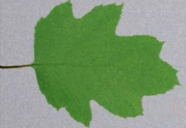
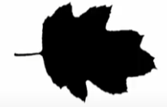
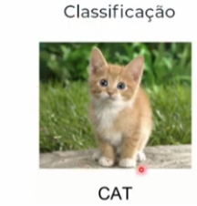
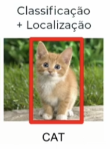
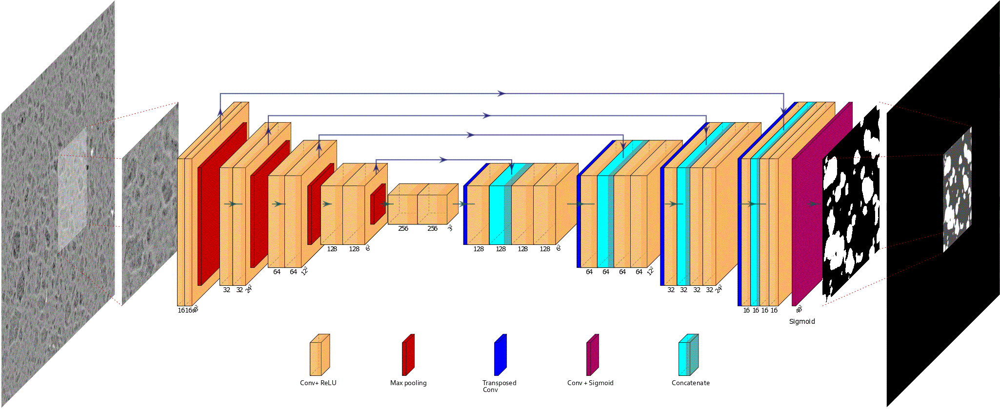
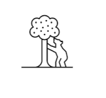
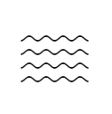

# Caracteristícas da segmentação
## Segmentação de imagens vs Detecção de objetos vs Classificação de imagens
Como visto anteriormente, a segmentação de imagens é o passo a passo de dividir e separar a imagem de entrada em diversas regiões homogêneas, isso significa dizer que, a segmentação consegue dividir e separar as caracteristicas da imagem de forma a encontrar padrões não vísiveis a olho nu ou através de outras técnicas. Pode ser visto na figura a seguir.

 

Ao observar a figura da folha, percebemos que a região verde da folha é uma parte homogênea da figura, então ao rodar algum algoritmo de segmentação o resultado esperado é que a regiaão verde seja abordado no algoritmo. Assim como, a cor de fundo da imagem(branca), conforme mostrado na figura ao lado. Essa técnica contém algumas diferenças dos assuntos já estudados anteriormente (detecção de objeto e classificação de imagens), pois ela não necessariamente é usada para compreender o objeto que está na imagem, sendo muito usada também para dividir a imagem em regiões.

Segue algumas definições dos assuntos, para esclarecer melhor:
- `classificação de imagem`: esse assunto contém a função de aplicar rotulos/labels para as imagens, por exemplo, se você enviar uma foto de gato ele saberá que é uma foto de gato ali, mas não saberá onde está o gato ou qual o formato desse gato. "Os sistemas de classificação de imagens convencionais são limitados em sofisticação" (IBM), essa citação explica que essa técnica não processa as caracteristicas da imagem de forma separada.

- `Detecção de objetos`: Essa técnica combina as caracteristicas da classificação com a localização da imagem, ela na verdade define o que chamamos de "caixa delimetadora", com isso, desenhando um retângulo na imagem para capturar a localização do objeto a ser detectado. Essa técnica consegue classificar varios objetos dentro de uma mesma imagem, mas isso contém uma perda de acurácia caso a imagem contenha diversos objetos colados um com os outros.

- `Segmentação de imagens`: Como abordado, essa técnica irá verificar pixel por pixel da imagem e dizer qual classe esse pixel contém(anotação de pixel). Essa técnica contém algoritmos mais classicos como o de detecção de bordas, mas ela atualmente é utilizado arquiteturas de redes convolucionais para extrair `mascaras de segmentação`, representando o limite de pixel a pixel específico e a forma de cada classe, mais polidas.

## Tipos de classes
Classes são rótulos que o algoritmo de segmentação coloca em cada pixel para entender qual tipo de pixel ele está analisando no momento. Existindo 2 tipos:
### Objetos
São classes de imagens/pixels que contém uma ou várias caracteristica marcantes, por exemplo, carro, pessoa, arvore. Essa classe tem a carateristica de que os elementos pertencentes a ela contém uma baixa variedade de tamanho. Além disso, os objetos contém partes constituintes distintas entre si, por exemplo, todos os carros tem rodas, mas a roda não é um carro. Como contem caracteristicas marcantes, os objetos conseguem ser contáveis nas imagens.

### Elementos do ambiente
Ao contrário do objeto, elementos do ambiente são amorfos com tamanho variável, por exemplo, céu, água, grama. COmo ela não tem instâncias individuais, então ela não consegue ser contável e claramente definida. " Ao contrário dos objetos, os elementos do ambiente não têm partes distintas: uma lâmina de grama e campo de grama são ambas igualmente "grama"." (IBM).

