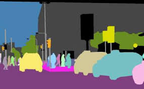
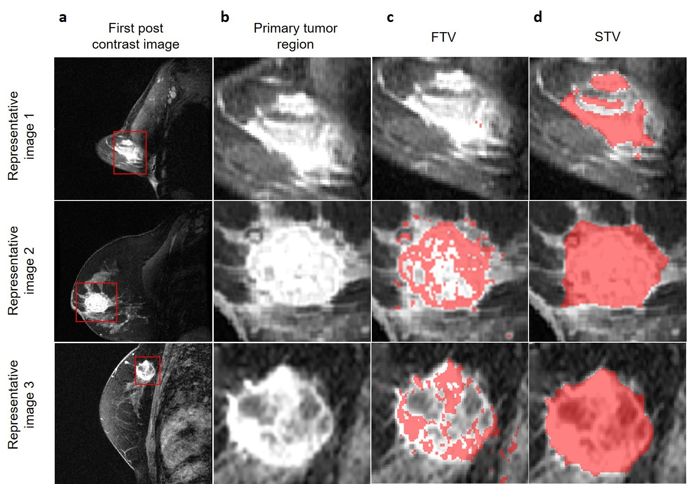
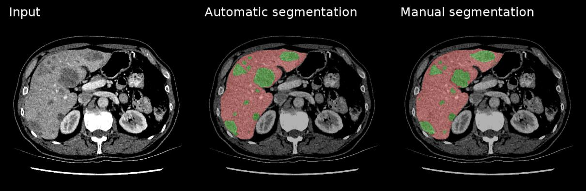
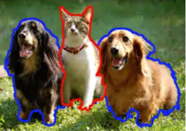

# Segmentação de Objetos em Imagens

## Introdução

A **segmentação de instância** é uma técnica avançada de visão computacional que combina os conceitos de segmentação semântica e detecção de objetos. Seu objetivo é não apenas classificar os pixels de uma imagem, mas também distinguir entre diferentes instâncias do mesmo tipo de objeto. Por exemplo, em uma imagem com dois carros, a segmentação de instância identifica ambos os carros como objetos separados, atribuindo uma máscara única a cada um.

 

## Algoritmos de Segmentação de Objetos

### Mask R-CNN

Uma das arquiteturas mais populares para segmentação de instância é a Mask R-CNN. Ela estende o modelo Faster R-CNN, que realiza a detecção de objetos, adicionando uma ramificação adicional para gerar uma máscara de segmentação para cada objeto identificado.

- Detecção de Propostas de Objetos: O modelo primeiro detecta regiões de interesse (ROIs) que podem conter objetos.
- Classificação e Regressão de Caixa: Cada ROI é classificada e ajustada para uma caixa delimitadora precisa.
- Máscara de Segmentação: Para cada ROI, uma máscara binária é gerada, segmentando os pixels que pertencem ao objeto.

Vantagens: Alta precisão, suporta múltiplas instâncias e tipos de objetos.

Desvantagens: Custo computacional elevado, pode ser difícil de treinar para grandes conjuntos de dados.

### YOLACT
O YOLACT é uma abordagem mais rápida para segmentação de instância, focada em tempo real. Ele divide o problema em duas partes:

- Proposta de Máscara: Criação de um conjunto de máscaras base para a imagem.
- Combinação com Caixas: As máscaras são combinadas com caixas delimitadoras para gerar as máscaras de instância final.

Vantagens: Muito rápido, adequado para aplicações em tempo real.

Desvantagens: Menor precisão comparada ao Mask R-CNN.

### DeepLab
Embora o DeepLab seja tradicionalmente usado para segmentação semântica, ele pode ser adaptado para segmentação de instância com a introdução de camadas adicionais que lidam com a separação de instâncias individuais.

## Aplicações

### Condução Autônoma

- **Condução Autônoma**: Identificação de pedestres, sinais de trânsito e veículos, permitindo que veículos autônomos tomem decisões em tempo real.
  - **Tipo de Segmentação usada**: Segmentação Panóptica. Neste contexto, a segmentação panóptica é preferida, pois fornece informações tanto sobre a posição e distinção entre objetos (como diferentes carros e pedestres) quanto sobre o contexto (como estradas e áreas de tráfego), essencial para o entendimento completo do ambiente.

   

### Diagnóstico Médico

- **Medicina**: Segmentação de células, tumores e outras estruturas em imagens médicas para diagnóstico e planejamento cirúrgico.
  - **Tipo de Segmentação usada**: Segmentação Semântica. Em diagnósticos médicos, não é necessário distinguir cada célula ou órgão individualmente, mas sim separar áreas de interesse, como tumores e tecidos saudáveis, para facilitar a análise de imagens de ressonância, tomografias ou exames de raio-X.

     

### Realidade Aumentada

- **Realidade Aumentada (AR)**: Segmentação de objetos para interação em tempo real, como filtros de rosto em aplicativos móveis e interação com objetos no ambiente.
  - **Tipo de Segmentação usada**: Segmentação de Instância. Na AR, é crucial distinguir diferentes objetos e partes (ex. rosto e mãos) para oferecer uma experiência interativa. A segmentação de instância permite essa distinção, possibilitando interações realistas em tempo real com objetos específicos.

## Conclusão

A segmentação de instância é uma técnica crucial em visão computacional, permitindo a identificação precisa de múltiplas instâncias de objetos em uma imagem. Com o avanço de arquiteturas como Mask R-CNN e YOLACT, é possível realizar a segmentação de forma cada vez mais eficiente e precisa, com aplicações em áreas que variam de condução autônoma à medicina.

À medida que a tecnologia avança, novas arquiteturas e algoritmos surgirão para melhorar a precisão e a velocidade da segmentação de instância, tornando-a ainda mais acessível para diversas aplicações.