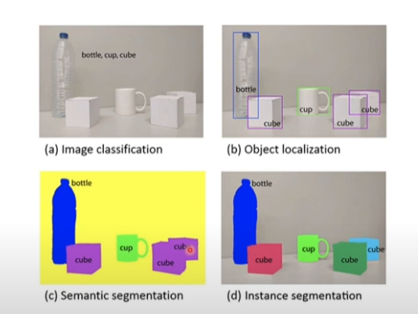
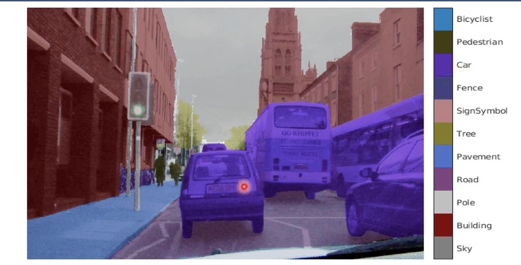
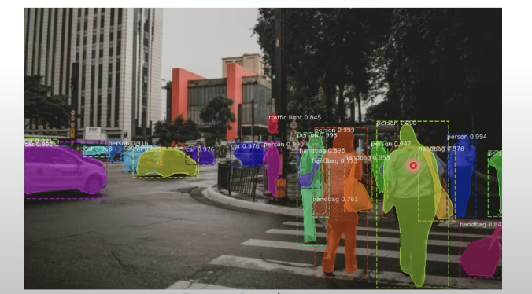
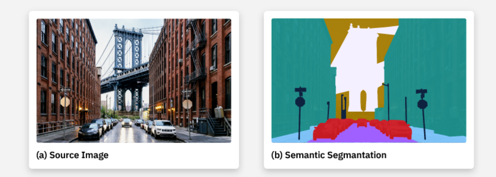
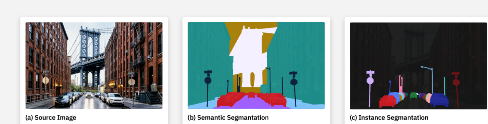
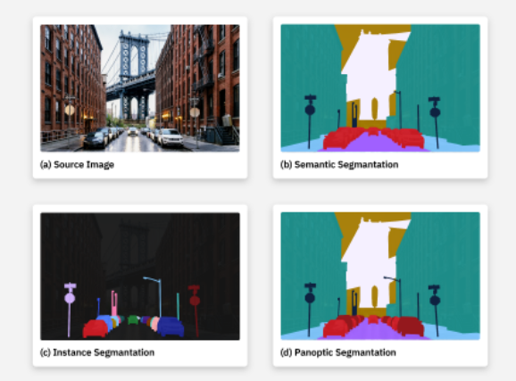

# Tipos de Segmentação
Para formar a segmentação de objetos, o tema de segmentação evoluiu com 3 tipos:

- `segmentação semântica`
- `segmentação por instância`
- `segmentação panóptica`

AO observar a imagem a seguir conseguimos diferenciar as 2 primeiras segmentações: semântica e por instância, além de poder comparar com os outros assuntos estudados anteriormente.

Para `classificação de objetos` é visto que ao dar uma imagem como entrada para o algoritmo ele classificará quais objetos a imagem contém, não tendo nenhuma responsabilida de localizar esses. Para `detecção de objeto`, ele funcionará em classificar os objetos da imagem mas também localizará esses com caixas delimetadoras, 1 garrafa, 3 cubos e 1 caneca.
Para `segmentação semântica`, ela continuará com a classificação dos objetos mas objetos iguais serão tratados da mesma forma, como visto, nos 3 cubos em roxo. Para `segmentação por instância`, ela tratará cada objeto segmentado como novo, por isso, que é chamado de por instância, já que é classificado cada instaância dos objetos que estão na imagem, percebe-se isso pelos os cubos que estao de cores diferentes.

Uma aplicação disso são os carros autonomos que utilizam da segmentação para verificar os objetos ao redor dele, mas ele utiliza da segmentação semântica, pois ele não se preocupa em diferenciar os objetos e sim em saber a borda desses e a distância que esta para o carro. Como visto na figura a seguir.

Outra imagem:

## Segmentação semântica
Por definição da IBM: A segmentação semântica é o tipo mais simples de segmentação de imagem. Um modelo de segmentação semântica atribui uma classe semântica a cada pixel, mas não produz qualquer outro contexto ou informação (como objetos).

Na pratica ela trata tudo como `elementos do ambiente`, não diferenciando os objetos e esses elementos. Por exemplo, um modelo treinado de segmentação semântica iria produzir uma mascara de segmentação capaz de atribuir classes aos elementos e objetos, mas nunca que esse conseguiria distinguir essas 2 classes.

## Segmentação de instâncias
Por definição da IBM: A segmentação de instâncias inverte as prioridades da segmentação semântica: enquanto os algoritmos de segmentação semântica preveem apenas a classificação semântica de cada pixel (sem considerar instâncias individuais), a segmentação de instâncias delineia a forma exata de cada instância de objeto separadamente.

BAsicamente, ela esta isolando o objeto dos elementos, com isso, ela acaba sendop uma versão evoluída da detecção de objeto, pois ao invez de capturar a localização desses objetos através de caixa, agora podemos localizar de acordo com a sua borda exata na imagem. Ou seja, sua mascara de segmentação acaba contendo um aperfeiçoamente em detectar objetos.

"Os algoritmos de segmentação de instância geralmente adotam uma abordagem de dois estágios ou de um tiro para o problema. Modelos de dois estágios, como redes neurais convencionais (R-CNNs) baseadas na região, realizam a detecção de objetos convencionais para gerar caixas delimitadoras para cada instância proposta e, em seguida, realizam uma segmentação e classificação mais refinadas dentro de cada caixa delimitadora. Modelos one-shot, como o YOLO (You Only Look Once), alcançam a segmentação de instâncias em tempo real ao realizar detecção de objetos, classificação e segmentação simultaneamente." (IBM)

## Segmentação Panóptica
Por definição da IBM: Os modelos de segmentação panóptica determinam a classificação semântica de todos os pixels e diferenciam cada instância de objeto em uma imagem, combinando os benefícios da segmentação semântica e da instância.

Basicamente, sua funcionalidade esta em varrer pixel por pixel e atribuir um rotulo e um ID de instancia, onde pixels que compartilham o mesmo ID e rotulo pertencem ao mesmo objeto e os IDS dos pixels de elemento de ambiente são ignorados.

