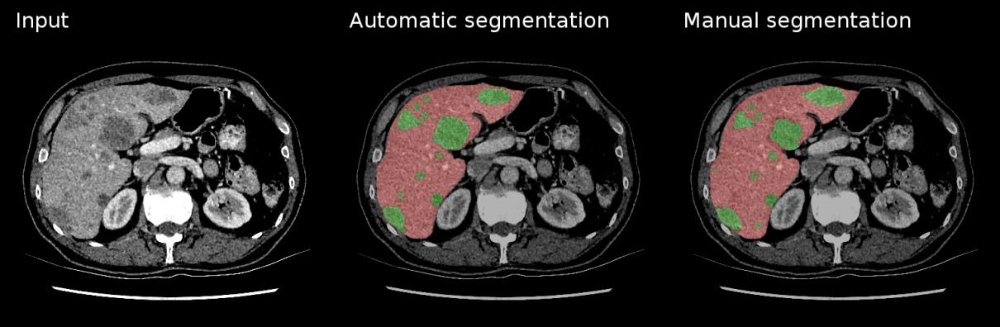

# Segmentação de Objetos em Imagens
 
## Aplicações

### Condução Autônoma

- **Condução Autônoma**: Identificação de pedestres, sinais de trânsito e veículos, permitindo que veículos autônomos tomem decisões em tempo real.
  - **Tipo de Segmentação usada**: Segmentação Panóptica. Neste contexto, a segmentação panóptica é preferida, pois fornece informações tanto sobre a posição e distinção entre objetos (como diferentes carros e pedestres) quanto sobre o contexto (como estradas e áreas de tráfego), essencial para o entendimento completo do ambiente.

   

### Diagnóstico Médico

- **Medicina**: Segmentação de células, tumores e outras estruturas em imagens médicas para diagnóstico e planejamento cirúrgico.
  - **Tipo de Segmentação usada**: Segmentação Semântica. Em diagnósticos médicos, não é necessário distinguir cada célula ou órgão individualmente, mas sim separar áreas de interesse, como tumores e tecidos saudáveis, para facilitar a análise de imagens de ressonância, tomografias ou exames de raio-X.

     

### Realidade Aumentada

- **Realidade Aumentada (AR)**: Segmentação de objetos para interação em tempo real, como filtros de rosto em aplicativos móveis e interação com objetos no ambiente.
  - **Tipo de Segmentação usada**: Segmentação de Instância. Na AR, é crucial distinguir diferentes objetos e partes (ex. rosto e mãos) para oferecer uma experiência interativa. A segmentação de instância permite essa distinção, possibilitando interações realistas em tempo real com objetos específicos.

